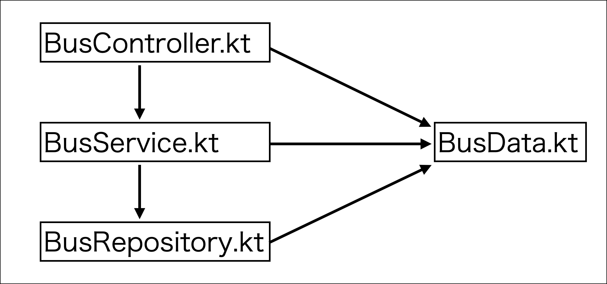

# bus-web-api

## Table of Contents
* [Requirements](#requirements)
* [Usage](#Usage)
    * [Start](#start)
    * [Shutdown](#shutdown)
    * [Log](#log)
    * [DB](#db)
* [Code](#code)
    * [Architecture](#architecture)
    * [Module Dependency](#module-dependency)
    * [Library](#library)

## Requirements
* Kotlin
* docker / docker-compose

## Usage
### Start
```
docker compose up -d
./gradlew bootRun 
```
### 全てのバス停を取得
`http://localhost:8080/stops`

### 指定した行き先までに経由するバス停を取得
`http://localhost:8080/stops/{trip_headsign}`

### 指定したバス停の時刻表を取得
`http://localhost:8080/timeTable/{stopName}`

### Shutdown
```
docker compose down
```
`Ctrl + C`

### Log
```
# ログの確認
docker compose logs

# ストリーミング
docker compose logs -f

# webサーバonly
docker compose logs web
docker compose logs -f web
```

### DB
マイグレーションツールの用意はありません。
<br>初回起動時に`sql/`以下にあるSQLファイルが実行されます。

## Code
### Architecture
```
.
├──src/main/kotlin/com.example.bus_web_api ----> application core codes
│                               ├── BusData.kt   
│                               ├── BusController.kt  
│                               ├── BusService.kt
│                               ├── BusRepository.kt
│                               └── BusWebApiApplication.kt
│
└── sql  ----> DB definition master
```

#### BusData.kt
データ・モノの表現やその振る舞いを記述しています。

#### BusController.kt
HTTPリクエストのハンドラを実装するクラスです。
リクエストからパラメータを読み取り、エンドポイントに応じた処理を行ってレスポンスを返します。

#### BusService.kt
Respositoryのメソッドを実行します。

#### BusRepository.tk
DBなど外部モジュールへアクセスし、データの保存・取得・更新などの処理を実装します。

#### BusWebApiApplication.kt
アプリケーションのmain関数を実装します。

### Module Dependency

### Library
* Spring Framework ([ドキュメント](https://docs.spring.io/spring-framework/reference/index.html))
* Encode
    * kotlinx.serialization ([ドキュメント](https://kotlinlang.org/docs/serialization.html))
